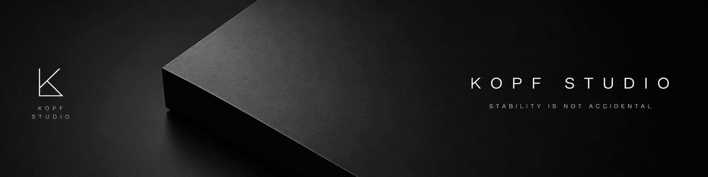
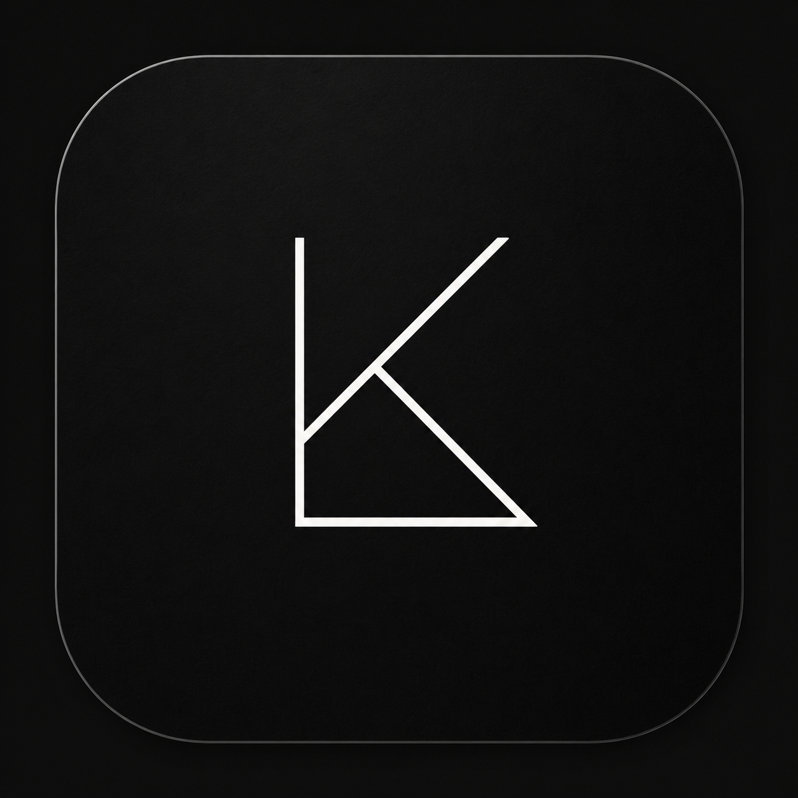

  

# Kopf Studio

**Premium software engineering for ambitious companies.**

Kopf Studio is a technology studio focused on designing and building software infrastructure for companies that need more than conventional development.

We work on backend-heavy platforms, internal systems, business automation, API architecture, third-party integrations, and operational tools built to perform reliably in real-world environments.

Our principle is simple:

> We believe stability is not accidental.

It is the result of clear architecture, disciplined execution, careful trade-offs, and software designed with long-term operation in mind.

---

## Contact

For business inquiries, technical partnerships, or selected software projects:

  

---

## What we build

- Backend systems and API architecture
- Custom business platforms
- Internal tools and operational systems
- Workflow automation
- Third-party integrations
- Data-driven business processes
- System modernization
- Scalable technical foundations

---

## How we think

We believe software should make companies more stable, not more dependent on fragile processes.

Every system we design is expected to be:

- reliable in production
- clear in architecture
- maintainable over time
- efficient to operate
- aligned with business goals
- prepared to scale with confidence

We value structure over improvisation, depth over hype, and long-term quality over unnecessary complexity.

---

## Where we are strongest

Kopf Studio is especially suited for projects involving:

- backend-heavy products
- automation of repetitive business operations
- complex integrations between systems
- internal platforms for teams and operations
- modernization of legacy workflows
- technical foundations for growing companies
- systems that require reliability, clarity, and maintainability

---

  

  <strong>Kopf Studio</strong> 
  Stability is not accidental.

